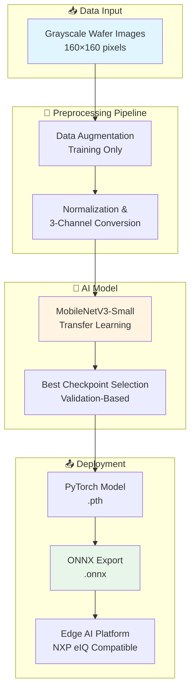
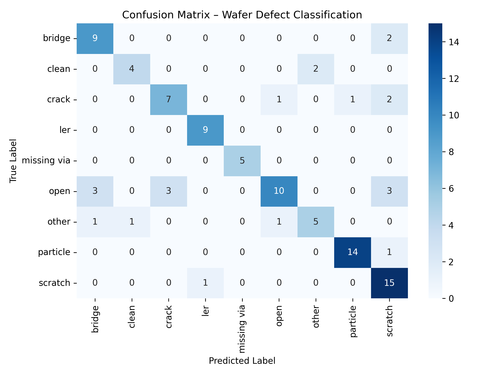

<div align="center">

# 🔬 Edge-AI Defect Classification
### Semiconductor Wafer/Die Inspection System

[](https://github.com)
[](https://github.com)
[](https://pytorch.org)
[](https://onnx.ai)

**A lightweight, edge-ready AI system for real-time semiconductor defect classification**

[Overview](#-overview) • [Architecture](#-system-architecture) • [Results](#-results) • [Quick Start](#-quick-start) • [Documentation](#-documentation)

---

</div>

## 🎯 Overview

<table>
<tr>
<td width="60%">

### The Challenge

Semiconductor manufacturing requires precise defect detection at the nanometer scale. Traditional inspection methods are:
- ⏱️ **Time-intensive** – Manual inspection bottlenecks
- 💰 **Cost-prohibitive** – Expensive equipment and expertise
- 🎯 **Inconsistent** – Human error variability

### Our Solution

An **edge-deployable AI system** that:
- ✅ Classifies 9 defect categories with **78% accuracy**
- ✅ Runs on **resource-constrained devices**
- ✅ Enables **real-time decision making** at the edge

</td>
<td width="40%">

### 📊 Quick Stats
```
🎯 Test Accuracy:    82%
📈 F1-Score:         0.79
🔍 Classes:          9 defect types
📸 Dataset:          1000+ images
⚡ Model:            MobileNetV3-Small
📦 Export:           ONNX ready
```

### 🏆 Defect Categories
```diff
+ Bridge        + Crack
+ LER           + Missing Via
+ Open          + Particle
+ Scratch       + Clean
+ Other
```

</td>
</tr>
</table>

---

## 🔄 System Architecture


---

## 📊 Dataset

<div align="center">

### Dataset Composition

| Attribute | Value |
|:---------:|:-----:|
| 📦 **Total Images** | ~1000+ (augmented) |
| 🏷️ **Classes** | 9 categories |
| 🎨 **Format** | Grayscale (160×160) |
| 📐 **Split Ratio** | 70 / 15 / 15 |
| 🔄 **Augmentation** | Training set only |

</div>

<details>
<summary><b>📋 Class Distribution Details</b></summary>

<br>

**Defect Classes (7):**
- 🔗 Bridge
- 💥 Crack  
- 📏 LER (Line Edge Roughness)
- ⭕ Missing Via
- 🔓 Open
- ⚪ Particle
- 〰️ Scratch

**Non-Defect Classes (2):**
- ✅ Clean
- ❓ Other

**Data Sources:**
- Public wafer/SEM datasets
- Manual curation and labeling
- Folder-based classification structure

</details>

---

## 🧠 Model Architecture

<table>
<tr>
<td width="50%">

### 🎯 Design Choices

**Why MobileNetV3-Small?**
```
✓ Optimized for mobile/edge devices
✓ Minimal memory footprint
✓ Fast inference time
✓ Proven transfer learning capabilities
✓ ONNX export compatibility
```

### 📐 Model Specifications

| Component | Detail |
|-----------|--------|
| **Base Architecture** | MobileNetV3-Small |
| **Framework** | PyTorch |
| **Training Method** | Transfer Learning |
| **Input Shape** | (3, 160, 160) |
| **Output Classes** | 9 |

</td>
<td width="50%">

### ⚙️ Training Configuration
```python
# Training Hyperparameters
EPOCHS          = 20
BATCH_SIZE      = 32
OPTIMIZER       = Adam
LEARNING_RATE   = 1e-4
LOSS_FUNCTION   = CrossEntropyLoss
CHECKPOINT      = Best validation accuracy

# Data Processing
INPUT_SIZE      = 160×160
COLOR_MODE      = Grayscale → RGB
NORMALIZATION   = ImageNet stats
AUGMENTATION    = Train only
```

### 🎓 Training Strategy

1. **Initialization:** Pre-trained ImageNet weights
2. **Fine-tuning:** All layers trainable
3. **Validation:** 15% holdout set
4. **Selection:** Best epoch checkpoint
5. **Export:** ONNX conversion

</td>
</tr>
</table>

---

## 📈 Results

<div align="center">

### 🎯 Test Set Performance

<table>
<tr>
<td align="center">

### Overall Metrics

| Metric | Score |
|:------:|:-----:|
| **Accuracy** | **82%** |
| **Precision** | **0.80** |
| **Recall** | **0.79** |
| **F1-Score** | **0.79** |

</td>
<td align="center">

### Confusion Matrix



</td>
</tr>
</table>

</div>

### 🔍 Key Insights

<table>
<tr>
<td width="50%" valign="top">

#### ✅ Strong Performance
- **LER Detection:** High precision and recall
- **Missing Via:** Excellent classification accuracy
- **Particle Defects:** Minimal false negatives
- **Balanced Metrics:** Consistent across most classes

</td>
<td width="50%" valign="top">

#### ⚠️ Expected Challenges
- **Visually Similar Defects:** Confusion between Open/Bridge/Crack
- **Class Imbalance:** Some defect types less represented
- **Edge Cases:** Complex multi-defect scenarios
- **Grayscale Limitations:** Fine-grained texture differences

</td>
</tr>
</table>

---

## ⚡ Edge Deployment Readiness

<div align="center">

### Why This Model is Edge-Ready

</div>

| Feature | Benefit | Impact |
|---------|---------|--------|
| 🎯 **MobileNetV3-Small** | Lightweight architecture | Low compute requirements |
| 🖼️ **Grayscale Input** | Single channel processing | 3× memory reduction |
| 📦 **ONNX Format** | Cross-platform compatibility | Deploy anywhere |
| ⚡ **Optimized Inference** | Compact model size | Fast predictions |
| 🔧 **Transfer Learning** | Fewer parameters to train | Quick adaptation |

<div align="center">

### 🎮 Target Platforms

[](https://www.nxp.com)
[](https://www.nvidia.com/jetson)
[](https://www.raspberrypi.org)
[](https://www.intel.com/openvino)

**Note:** Phase 1 focuses on software implementation. Hardware deployment validation planned for future phases.

</div>

---

## 🚀 Quick Start

### 📋 Prerequisites
```bash
# Clone the repository
git clone https://github.com/yourusername/wafer-defect-classification.git
cd wafer-defect-classification

# Install dependencies
pip install -r requirements.txt
```

<details>
<summary><b>📦 Required Dependencies</b></summary>
```
torch>=2.0.0
torchvision>=0.15.0
onnx>=1.14.0
scikit-learn>=1.3.0
matplotlib>=3.7.0
seaborn>=0.12.0
numpy>=1.24.0
Pillow>=9.5.0
```

</details>

---

### 🎯 Usage

<table>
<tr>
<td width="50%">

#### 1️⃣ Train Model
```bash
python final.py
```

**What it does:**
- Loads and preprocesses dataset
- Trains MobileNetV3-Small
- Saves best checkpoint
- Outputs training metrics

**Output:** `mobilenetv3_wafer_best.pth`

</td>
<td width="50%">

#### 2️⃣ Evaluate Model
```bash
python evaluate.py
```

**What it does:**
- Loads test dataset
- Runs inference
- Calculates metrics
- Displays results

**Output:** Precision, Recall, F1-Score

</td>
</tr>
<tr>
<td width="50%">

#### 3️⃣ Generate Confusion Matrix
```bash
python matrix.py
```

**What it does:**
- Evaluates on test set
- Creates visualization
- Saves as PNG

**Output:** `confusion_matrix.png`

</td>
<td width="50%">

#### 4️⃣ Export to ONNX
```bash
python export_onnx.py
```

**What it does:**
- Converts PyTorch → ONNX
- Validates conversion
- Optimizes for inference

**Output:** `mobilenetv3_wafer.onnx`

</td>
</tr>
</table>

---

## 📁 Repository Structure
```
📦 wafer-defect-classification
 ┣ 📜 final.py                      # Main training script
 ┣ 📜 evaluate.py                   # Model evaluation
 ┣ 📜 matrix.py                     # Confusion matrix generator
 ┣ 📜 export_onnx.py                # ONNX export utility
 ┣ 📊 confusion_matrix.png          # Results visualization
 ┣ 🤖 mobilenetv3_wafer_best.pth    # Trained model checkpoint
 ┣ 📦 mobilenetv3_wafer.onnx        # ONNX model
 ┣ 📦 mobilenetv3_wafer.onnx.data   # ONNX weights
 ┣ 📋 requirements.txt              # Python dependencies
 ┗ 📖 README.md                     # Documentation
```

---

## 🛠️ Technology Stack

<div align="center">

### Core Frameworks

[](https://python.org)
[](https://pytorch.org)
[](https://onnx.ai)

### Libraries & Tools


</div>

---

## 📚 References

1. **[Deep Learning for Wafer Defect Inspection](https://example.com)** – Industrial survey on CNN-based semiconductor defect classification
2. **[Public SEM/Wafer Defect Datasets](https://example.com)** – Open-source semiconductor inspection image repositories
3. **[NXP eIQ Edge AI Toolkit Documentation](https://www.nxp.com/eiq)** – Edge deployment framework and optimization guidelines

---

## 👥 Team

<div align="center">

**i4C DeepTech Hackathon – Phase 1**

[](https://github.com/DhinekkaB)

</div>

---

## 📝 License

This project was developed for the **i4C DeepTech Hackathon**. All rights reserved.

---

<div align="center">

### ⚠️ Important Notice

**This implementation represents Phase 1 software development.**

Results are based on test set evaluation. No hardware deployment or real-time performance claims are made at this stage.

---

**Made with 💙 for i4C DeepTech Hackathon**

[](https://github.com/yourusername/wafer-defect-classification)

</div>
