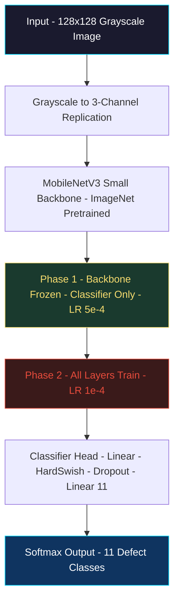
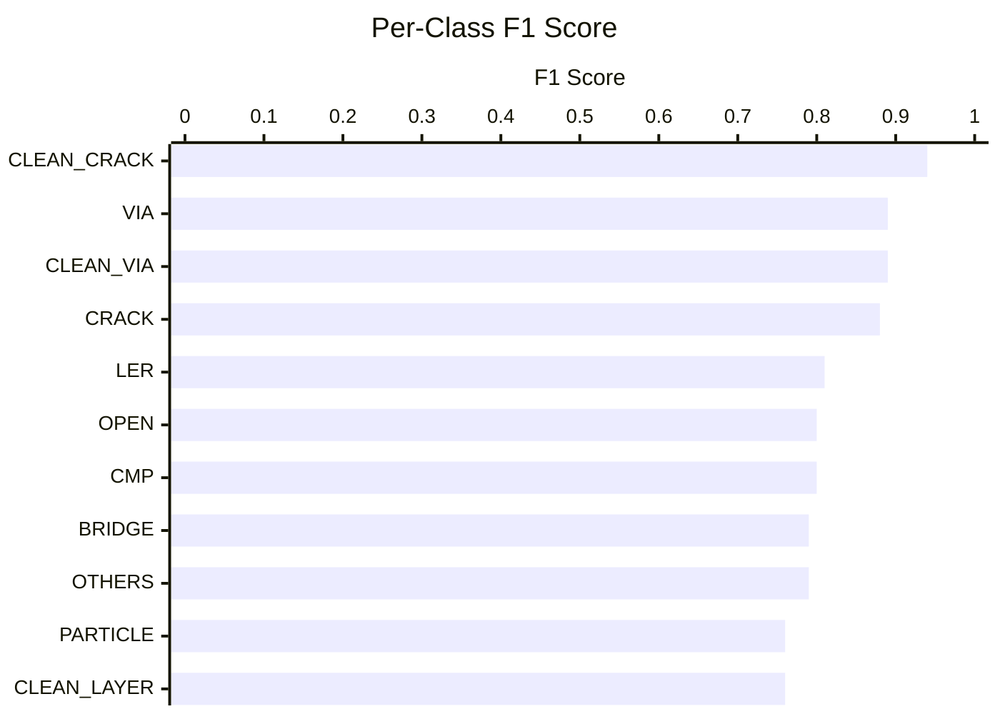
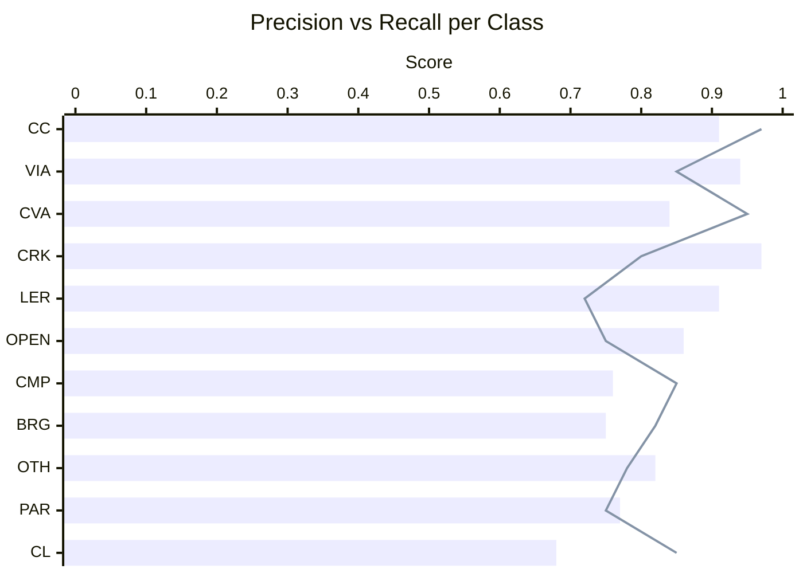
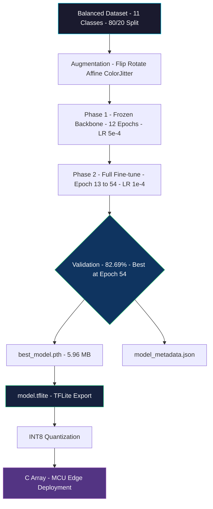
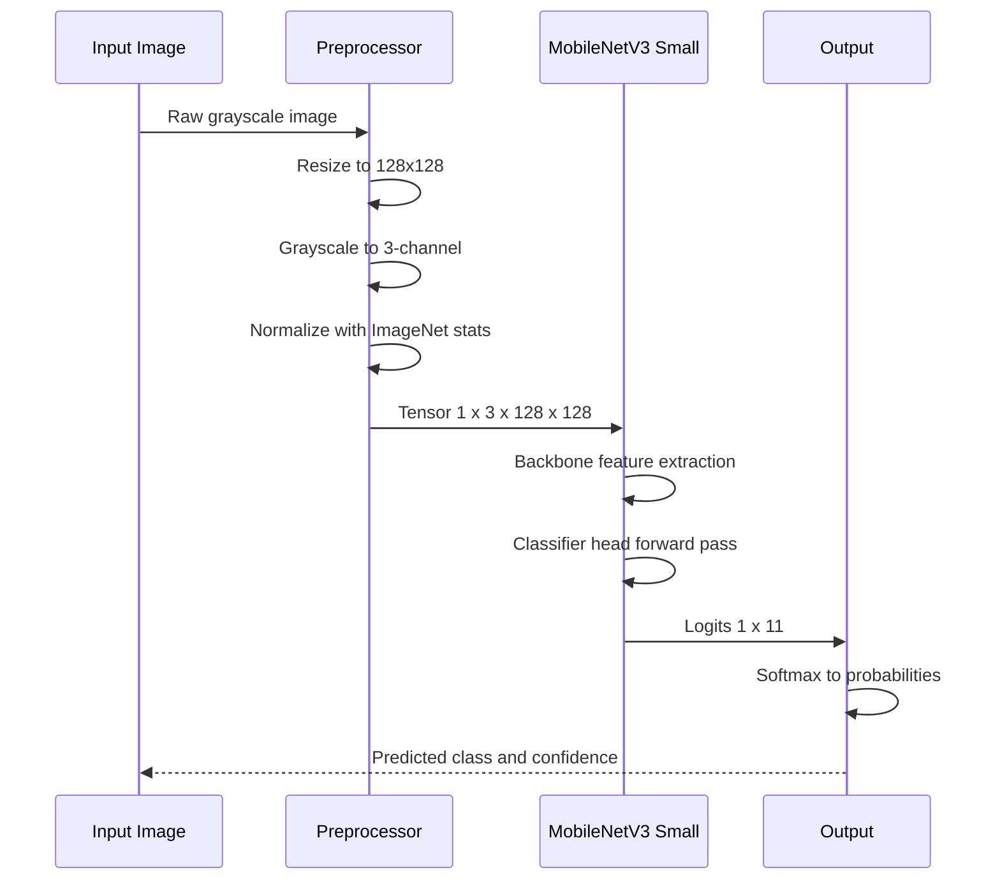
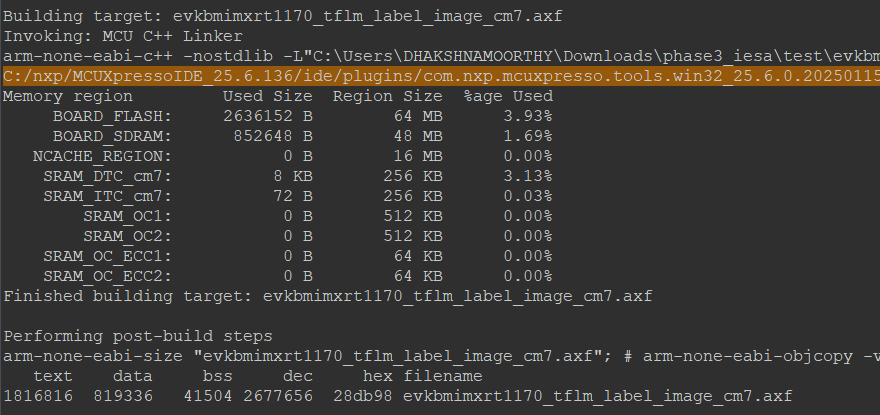

<div align="center">


<p>
  
  
  
  
</p>
<p>
  
  
  
  
</p>

<a href="https://git.io/typing-svg">
  
</a>

</div>

---

## 📋 Table of Contents

- [🎯 Overview](#-overview)
- [🏗️ Architecture](#%EF%B8%8F-architecture)
- [⚙️ Training Configuration](#%EF%B8%8F-training-configuration)
- [📊 Results](#-results)
- [📈 Performance Charts](#-performance-charts)
- [🗂️ Classification Report](#%EF%B8%8F-classification-report)
- [🚀 Deployment Pipeline](#-deployment-pipeline)
- [📁 File Structure](#-file-structure)
- [💻 Quick Inference](#-quick-inference)

---

## 🎯 Overview

<div align="center">

> **Phase 3** trains a lightweight, deployment-ready deep learning model for **semiconductor wafer defect classification** using two-phase transfer learning on MobileNetV3 Small. Goal: maximum accuracy in a minimal footprint for edge deployment.

</div>


---

## 🏗️ Architecture



**Model Size:** `5.96 MB (.pth)` &nbsp;|&nbsp; **TFLite:** `model.tflite` ✅ &nbsp;|&nbsp; **Total Params:** ~1.52M

---

## ⚙️ Training Configuration

<div align="center">

| Parameter | Value |
|-----------|-------|
| 🖼️ Image Size | `128 × 128` |
| 📦 Batch Size | `32` |
| 🔄 Max Epochs | `80` |
| 🏆 Best Epoch | **54** |
| ✂️ Val Split | `20% stratified` |
| 🧊 Phase 1 LR | `5e-4` — frozen backbone, epochs 1–12 |
| 🔥 Phase 2 LR | `1e-4` — full fine-tune, epochs 13–54 |
| ⚖️ Weight Decay | `1e-3` |
| ⏹️ Early Stop | `patience = 15` |
| 📉 Loss | `CrossEntropyLoss + Label Smoothing (0.1)` |
| 🔧 Optimizer | `AdamW` |
| 📅 Scheduler | `ReduceLROnPlateau (factor=0.5, patience=3)` |
| 🎨 Augmentation | `Flip (p=0.5) · Rotation ±20° · Affine · ColorJitter` |

</div>

### Two-Phase Training Strategy

```mermaid
gantt
    title Training Timeline — Best Epoch 54 of 80
    dateFormat X
    axisFormat Ep %s

    section Phase 1 Frozen Backbone
    Classifier only  LR 5e-4    :done, 0, 12

    section Phase 2 Full Fine-tune
    All layers  LR 1e-4         :active, 12, 54

    section Early Stopping
    Patience window triggered   :crit, 54, 69
```



---

## 📊 Results

<div align="center">

### 🏆 Final Metrics

| Metric | Score |
|--------|-------|
| ✅ **Validation Accuracy** | **82.69%** |
| 📊 Macro Avg Precision | **0.84** |
| 📊 Macro Avg Recall | **0.83** |
| 📊 Macro Avg F1-Score | **0.83** |
| 🗓️ Best Epoch | **54 / 80** |
| 💾 Model Size | **5.96 MB** |
| 🧪 Val Samples | **439** (20% stratified) |

</div>

---

## 📈 Performance Charts

### Per-Class F1 Score



### Precision vs Recall Per Class



> **CC** = CLEAN\_CRACK &nbsp;·&nbsp; **CVA** = CLEAN\_VIA &nbsp;·&nbsp; **CRK** = CRACK &nbsp;·&nbsp; **BRG** = BRIDGE &nbsp;·&nbsp; **OTH** = OTHERS &nbsp;·&nbsp; **PAR** = PARTICLE &nbsp;·&nbsp; **CL** = CLEAN\_LAYER

---

## 🗂️ Classification Report

<div align="center">

| Class | Precision | Recall | F1-Score | Support | Status |
|-------|:---------:|:------:|:--------:|:-------:|:------:|
| 🟢 **CLEAN_CRACK** | 0.91 | 0.97 | **0.94** | 40 | ✅ Excellent |
| 🟢 **VIA** | 0.94 | 0.85 | **0.89** | 40 | ✅ Excellent |
| 🟢 **CLEAN_VIA** | 0.84 | 0.95 | **0.89** | 39 | ✅ Excellent |
| 🟢 **CRACK** | 0.97 | 0.80 | **0.88** | 40 | ✅ Excellent |
| 🟡 **LER** | 0.91 | 0.72 | **0.81** | 40 | ⚡ Good |
| 🟡 **OPEN** | 0.86 | 0.75 | **0.80** | 40 | ⚡ Good |
| 🟡 **CMP** | 0.76 | 0.85 | **0.80** | 40 | ⚡ Good |
| 🟡 **BRIDGE** | 0.75 | 0.82 | **0.79** | 40 | ⚡ Good |
| 🟡 **OTHERS** | 0.82 | 0.78 | **0.79** | 40 | ⚡ Good |
| 🟠 **PARTICLE** | 0.77 | 0.75 | **0.76** | 40 | 🔧 Fair |
| 🟠 **CLEAN_LAYER** | 0.68 | 0.85 | **0.76** | 40 | 🔧 Fair |
| | | | | | |
| **Accuracy** | | | **0.83** | **439** | |
| **Macro Avg** | **0.84** | **0.83** | **0.83** | 439 | |
| **Weighted Avg** | **0.84** | **0.83** | **0.83** | 439 | |

</div>

> 🔑 **Strongest:** `CRACK (P=0.97)`, `VIA (P=0.94)`, `LER (P=0.91)` — critical defects caught with high precision  
> ⚠️ **Weakest:** `CLEAN_LAYER (P=0.68)` — visually similar to other clean surfaces; candidate for targeted augmentation in Phase 4

---

## 🚀 Deployment Pipeline



### Inference Sequence



---
## Deployment result
On porting we got
<p align="center">
  
</p>
---


## 📁 File Structure

```
phase3_results/
├── 📂 logs/
│   └── 📄 train_log.txt              ← Full epoch-by-epoch training log
├── 📂 code/ 
│    └── 📄 TRAIN_FINAL.py            ← Full training pipeline   
│   └── 📄 TEST_PREDICTIONS.py        ← Inference and prediction script    
│ 
├── 📦 best_model.pth                 ← PyTorch checkpoint (5.96 MB)
├── 📱 model.tflite                   ← TFLite deployment model ✅
├── 📋 model_metadata.json            ← Architecture config and metrics
└── 📖 README.md                      ← This file
```

---

## 💻 Quick Inference

```python
from torchvision import transforms, models
import torch, torch.nn as nn
from PIL import Image

CLASS_NAMES = [
    'BRIDGE', 'CLEAN_CRACK', 'CLEAN_LAYER', 'CLEAN_VIA',
    'CMP', 'CRACK', 'LER', 'OPEN', 'OTHERS', 'PARTICLE', 'VIA'
]

# Load model
model = models.mobilenet_v3_small(weights=None)
model.classifier[3] = nn.Linear(model.classifier[3].in_features, 11)
model.load_state_dict(torch.load("best_model.pth", map_location="cpu"))
model.eval()

# Preprocessing — must match training exactly
transform = transforms.Compose([
    transforms.Resize((128, 128)),
    transforms.Grayscale(num_output_channels=3),
    transforms.ToTensor(),
    transforms.Normalize([0.485, 0.456, 0.406], [0.229, 0.224, 0.225])
])

# Predict
img = transform(Image.open("your_image.png").convert("RGB")).unsqueeze(0)
with torch.no_grad():
    probs = torch.softmax(model(img), dim=1)
    pred  = torch.argmax(probs).item()

print(f"Prediction : {CLASS_NAMES[pred]}")
print(f"Confidence : {probs[0, pred]:.2%}")
```
---
<div align="center">


**Phase 3 Complete** &nbsp;·&nbsp; MobileNetV3 Small &nbsp;·&nbsp; **82.69% Accuracy** &nbsp;·&nbsp; TFLite ✅


</div>

---
